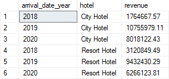
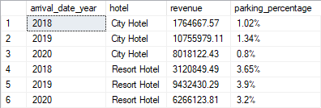
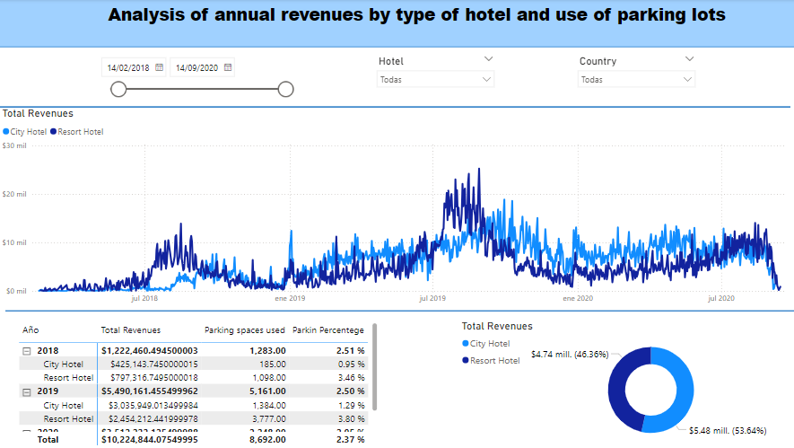
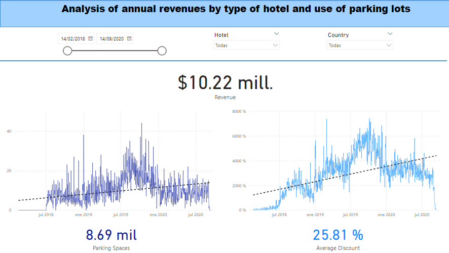
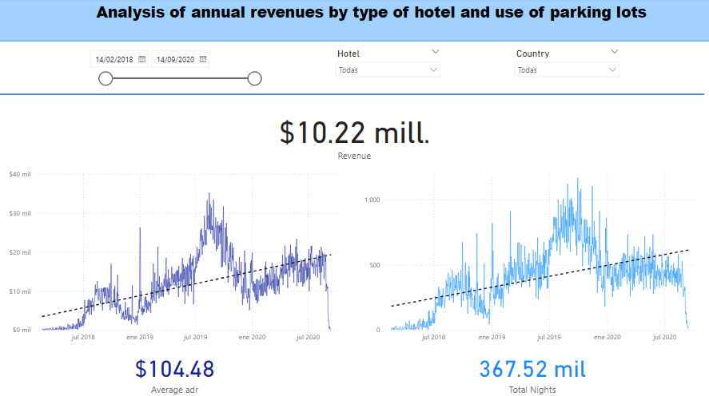

# *Hotel revenues and parking usage*

## Purpose of the Analysis

The annual records of a hotel chain are analyzed to provide information to
stakeholders on annual revenue growth, parking usage, and other potential
insights that can be derived from the data.

The objective of this project is to showcase my proficiency in utilizing
fundamental SQL functions to extract valuable insights, which are then
processed in Power BI. The results are presented to stakeholders in an easily
understandable manner.

## Data Collection

This dataset is fictitious and was obtained from the *Absent Data* website. It
is intended solely for self-learning purposes.

## Data Preprocessing

In this section, we describe the processes and decisions made to prepare the
data for analysis and interpretation. 

The data was initially recorded in an **Excel** file containing five sheets, three
of which have more than 20,000 rows each. To manage this volume of data more
efficiently, it was decided to import the file into **SQL Server Management
Studio**.

Initially, we combined several tables to perform queries more efficiently. The
following code block was used for this purpose:


```
WITH hotels AS(
SELECT * FROM dbo.[2018]
UNION
SELECT * FROM dbo.[2019]
UNION
SELECT * FROM dbo.[2020])
```

Subsequently, we verified that the columns of interest for the analysis did
not contain null values.

To create the visualizations, the data were first combined using SQL commands
and then exported to Power BI.

## Data Analysis

To address our first question about annual revenue growth, we performed a
query using SQL commands. The results indicate that annual revenue growth
varies, primarily depending on the type of hotel. Notably, 2019 was the year
with the highest total revenue.

<p align="center">
  
</p>


On the other hand, as shown in the following query, the parking lot is not
heavily utilized by customers. Therefore, there is no need to increase the
parking space at this time.

<p align="center">
  
</p>

Additionally, both types of hotels contribute a similar amount to total
revenue, as shown in the following visualizations. The second half of 2019
stands out as the highest revenue period to date.

<p align="center">
  
</p>

Finally, from the following visualizations, we can observe that:

* The number of parking spaces used does not usually exceed 20.
* The Average Daily Rate (ADR) has increased significantly over time and shows no signs of decreasing suddenly.
* The behavior of ADR is quite similar to the total number of occupied nights.

<p align="center">
  
    
</p>

## Conclusion  

After analyzing these data, we conclude with the following observations and recommendations:

- **Revenue Trends:** While total earnings have increased from the initial period,
there was a significant decrease from 2019 to 2020. This decline could be
related to the reduction in discounts offered by the hotel chain.

- **Parking Space Management:** The usage of the parking lot has consistently
been low, so investing in its expansion is not recommended at this time.

- **ADR Trends:** The Average Daily Rate (ADR) has shown a significant and
consistent increase over time, reflecting a strong pricing strategy and demand
stability.

- **Occupancy Rates:** Since the Average Daily Rate (ADR) and the number of
occupied nights exhibit similar trends, a more exhaustive examination of these
two variables is recommended to determine their correlation.

- **Revenue Contributions:** Both types of hotels contribute similar amounts
of profit, so it would be worthwhile to analyze each one separately to obtain
better individual results and improve their performance.


## Credits

I used the following project as the basis for this work: 

- Absent Data. *Data Analysis Mastery: Step-by-Step Portfolio Project Guide*. absentdata.com