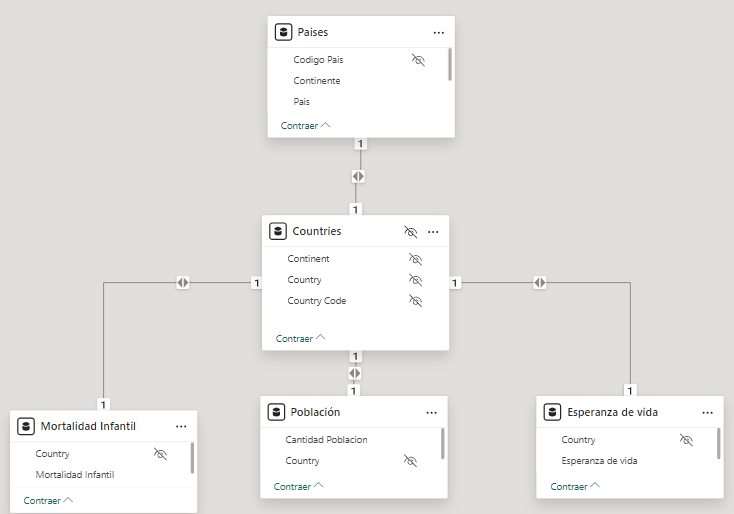
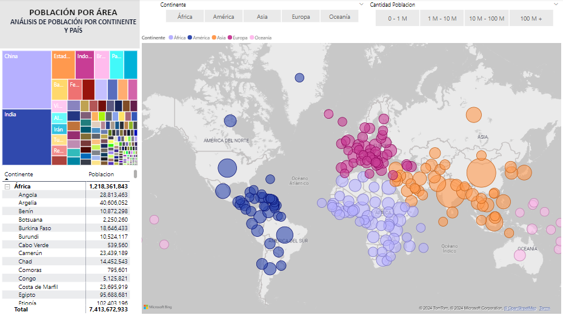
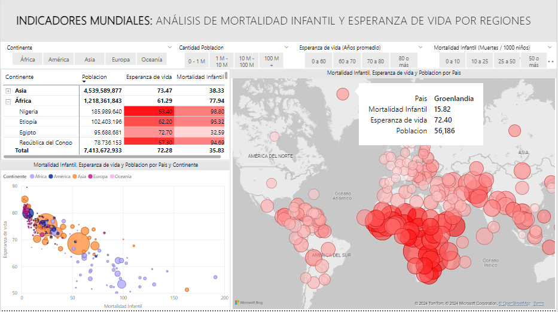

# *Life Expectancy and Infant Mortality by Countries*

## Purpose of the Analysis

We analyzed several databases to determine the relationship between life expectancy and infant mortality across countries worldwide.

All five continents were studied: America, Asia, Africa, Europe, and Oceania, along with their respective countries. The variables considered were total population per country, average life expectancy, and infant mortality (per thousand children)

## Data Collection

These data are part of a **Power BI** course I completed and were provided by the instructor as examples, so there may be inaccuracies. However, they are sufficient for conducting an initial study and testing proficiency in using the software.

## Data Analysis 

This section outlines the processes and decisions made regarding the data to prepare it for analysis and interpretation.

Since the data bases in **Excel** are well-formatted, there was no need for data cleanup within the software. Instead, we chose to directly import these data into **Power BI** and apply modifications using  **Power Query**. The primary changes made are listed below:

 - The function `Use first row as header` was used to promote the headers.
 - The data types of each column were set to `text`, `number`, `Int64.Type`, etc., as appropriate.
 - Create and edit relationships between different databases in **Model view**.
 - Hide columns and databases that are no longer needed.
 - Renamed columns for better interpretation and added conditional columns.

Below, we present the final model with the respective relationships between the databases:

  

## Data  Interpretation

In our first panel, we display the total population of each country, segmented by color according to its continent.

  

The second panel examines the number of inhabitants, life expectancy, and infant mortality (per thousand children). 
For this purpose, we provide several visual aids along with a series of filters at the top.

The following is a brief explanation of the elements on this second panel:

1. The table displays the total population, average life expectancy, and infant mortality. The following filter was applied to the table: cells become more colored with lower average life expectancy and higher infant mortality.

1. On the map, the size of each bubble is proportional to infant mortality, while a bright red color indicates lower life expectancy.

1. On the scatter plot, we compare life expectancy and infant mortality, with the size of the bubbles proportional to each country's population.

  

Although no comprehensive study has been conducted on the relationship between these two variables, our results suggest that infant mortality is inversely proportional to life expectancy. 

It is observed that developing countries have the highest rates of infant mortality, particularly in Africa and many regions of Asia and South America.
The reasons are due to various economic, health, and safety factors, for which we lack the data to provide a relevant conclusion or recommendation.

My recommendation is to conduct a more in-depth study using advanced statistical methods, such as linear regression, time series analysis, or random forest

## Credits

These data were obtained from the course *'Curso Power BI – Análisis de Datos y Business Intelligence'* taught by Javier Gomez and *datdata – Cursos* on the Udemy platform.
