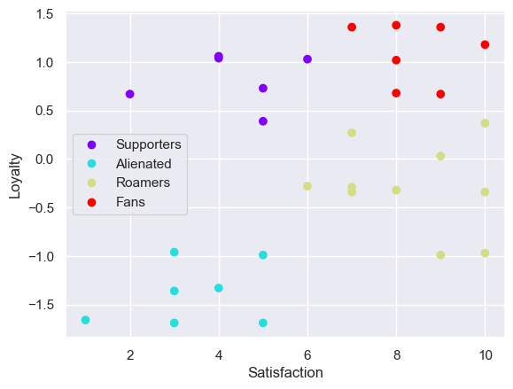

# Classification of customers by using Clusters Analysis

## Purpose of the Analysis

The objective of this work is to utilize clustering techniques to classify customers based on their satisfaction and loyalty. This will enable the store to implement measures aimed at increasing and retaining as many customers as possible.

## Data Collection

These data are part of a Data Science course I completed and were provided by the instructor.

The context of this exercise is the following: 

A retail store conducts a survey among its customers to increase its sales numbers. The survey considered two parameters: 'Satisfaction', measured on a scale from 1 to 10, with 10 being equivalent to 'Excellent,' and 'Loyalty, determined by the number of purchases made in the store over the course of a year.

## Data Analysis

This section outlines the processes and decisions made regarding the data to prepare it for analysis and interpretation.

The analysis was performed using _Python_ with the following libraries: `numpy`, `pandas`, `matplotlib`, `sklearn` and `seaborn`.

Since the 'ipynb' file contains detailed comments explaining the process, we will focus on summarizing the steps performed for the analysis.

1. The first step is to plot the data to determine whether an exhaustive analysis is required to obtain the clusters or if they occur naturally.

1. The variables are standardized to enable the use of the `KMeans` algorithm for building the clusters.

1. The _Elbow method_ is used to determine the number of clusters to be studied.

1. After conducting the relevant tests, it is concluded that using four clusters satisfactorily meets the proposed objective.

## Data Interpretation

As shown in the following figure, customers have been classified into four main groups: 'Alienated', 'Fans', 'Supporters', and 'Roamers'. These groups reflect how loyal and satisfied customers are with the services provided by the store.

Therefore, we have the following suggestions for the store:

1. To turn 'Supporters' into 'Fans,' we must increase their shopping satisfaction; 
otherwise, they could become 'Alienated'.

2. On the other hand, the 'Roamers' are satisfied but not loyal. To encourage them to visit more frequently, we may introduce loyalty programs such as discount vouchers, loyalty cards, raffles, etc.

3. The same techniques used for the 'Roamers' can be implemented for the 'Alienated'.

4. Finally, it is recommended to conduct an in-depth study of the 'Fans' to determine decisive factors that enable the store to increase the number of members in this group. Factors to be considered in the study may include age, marital status, social status, store visiting hours, etc.

## Credits
These data were obtained from the course 'The Data Science Course: Complete Data Science Bootcamp 2024' taught by 365 Careers on the Udemy platform.
