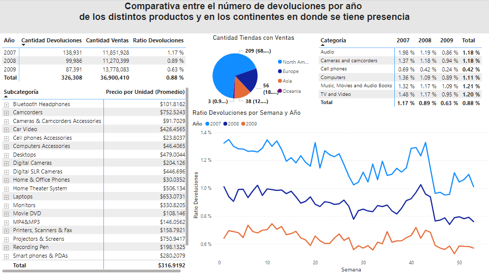
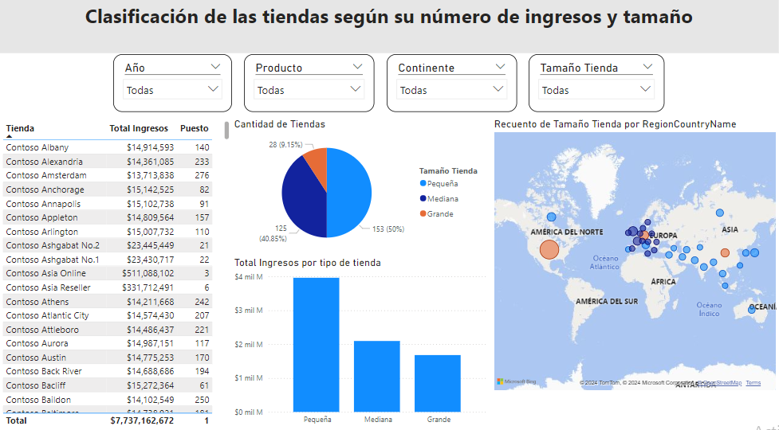
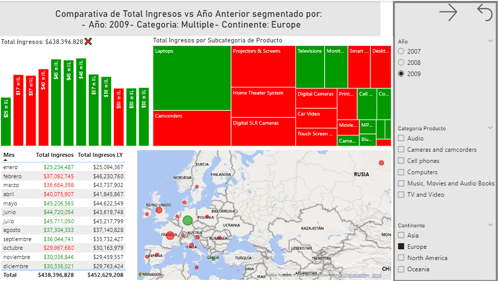

# *Sales and Returns of Products*

## Purpose of the Analysis

We analyzed *Contoso* company's sales to determine the behavior of its sales and returns in recent years.

We studied the different categories of electronic products they sell, their return rates by year and region, and compared their revenues to the same period last year.

## Data Collection

These data are part of a **Power BI** course I completed and were provided by the instructor as examples, so there may be inaccuracies. However, they are sufficient for conducting an initial study and testing proficiency in using the software.

## Data Preprocessing

This section outlines the processes and decisions made regarding the data to prepare it for analysis and interpretation.

Since the data bases in **Access** are well-formatted, there was no need for data cleanup within the software. Instead, we chose to directly import these data into **Power BI** and apply modifications within. The primary changes made are listed below:

 - Created and edit relationships between different databases in **Model view**.
 - Hide columns, variables and databases that are no longer needed.
 - Created columns and measures using **DAX** functions to obtain relevant information.
 - Created **tooltips** to enhance the interpretation of visualizations.
 - Applying filters to the visualizations to show only relevant data.

## Data  Analysis

In our first panel, we show the trend of returns in recent years by category and subcategory. 

  
      <figcaption style="text-align:center">Panel 1: Return history.</figcaption>

 

 
 Meanwhile, the second panel shows the variation in total revenue from a specific date compared to the corresponding date of the previous year. Additionally, we added color indicators to facilitate the interpretation of the variation: green indicates an increase, while red indicates a decrease.
 
 

 
  <figcaption style="text-align:center">Panel 2: Annual variation.</figcaption>

In the third panel, we can observe the total sales amount of each store and its global ranking. Additionally, several filters were added to analyze sales by store size, product, year, and continent.

 
  <figcaption style="text-align:center">Panel 3: Store classification.</figcaption>

In our last panel, we conduct a more in-depth study of the annual variation in total revenues. This study is segmented by year, continent, and product category. Once again, we use the same color pattern: green indicates an increase, while red indicates a decrease.

 
  <figcaption style="text-align:center">Panel 4: Store classification.</figcaption>

## Data  Interpretation

As shown in the first panel, the number of returns has decreased over time. Unfortunately, there is no available information to determine the cause, preventing us from taking similar measures to ensure the continued decrease.

Furthermore, as observed in the second and fourth panels, despite 2009 having the lowest number of returns, its total revenues do not exceed those of 2008. Therefore, we can infer that the store's greatest losses are not primarily due to the number of returns but potentially to other factors such as advertising, location, product variety, etc.

In this regard, a more exhaustive study could be considered to find a correlation between the products sold and the time periods in which they are sold. A possible approach could be to focus on selling certain products seasonally, thereby increasing sales and keeping inventory free of unsold products.

Finally, most of the company's stores are small, but they generate the most profits. Therefore, it is essential to prioritize small stores when developing sales plans, such as advertising or restocking, instead of focusing exclusively on large and medium-sized stores.

## Credits

These data were obtained from the course *'Curso Power BI – Análisis de Datos y Business Intelligence'* taught by Javier Gomez and *datdata – Cursos* on the Udemy platform.